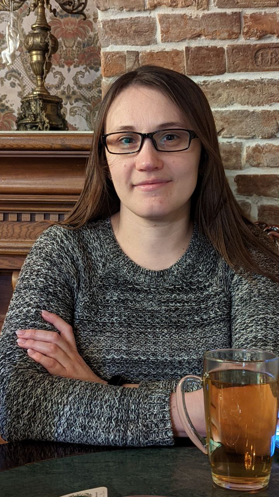

# Olena Koppalova

### Junior Frontend Developer

---



---

## Contact information:

**Phone:** +380964655153

**E-mail:** lenhack1@gmail.com

**Telegram:** @YelenaDK

**Linkedin** [LinkedIn](http://linkedin.com/in/елена-коппалова-8538a91b6)

---

## About myself:

I was dreaming to become a developer for a long time. I learned Java on "Java Rush" and Python on "Stepik". I was graduated from Online University TOMMY as a QA, but I understood that I really want to be developer in fact. So, I decided to begin to study in RS School and to become a developer. I really like to decide different tasks and I hope my dream will become a real.

---

## Skills and Proficiency:

- HTML5, CSS3;
- JavaScript Basics;
- Python Basics;
- Java Basics;
- C Basics;
- Git, GitHub;
- VS Code;
- Adobe Photoshop, Corel DRAW, Figma

---

## Code example:

- **Python:**

  _This code convert from decimal to binary_

```Python
a = int(input())
s = ""
while a >= 1:
    if a % 2 == 1:
        s = s + "1"
    elif a % 2 == 0:
        s = s + "0"
    a = a // 2
print(s[::-1])
```

- **C**

  _This function converts the string argument str to an integer (int type) and returns it._

```C
char* ft_itoa(int n){
    int t = n;
    int len_num = 0;
    while(t/=10){
        len_num++;
    }
    len_num++;

    char* str = (char*)malloc(len_num +1);
    int i = 0;

    if(n<0){
        str[0] = '-';
        n *= -1;
        i++;
    }

    while(len_num >= i){
        str[len_num] = (n%10) + '0';
        n/=10;
        len_num--;
    }
    str[ft_strlen(str)] = '\0';
    return str;
}
```

---

## Courses:

- RS School JS Frontend Stage 0 [RS School JS Frontend Stage 0](https://rs.school/)

- Online University TOMMY "Тестувальник програмного
  забезпечення (QC / QA)" [Online University TOMMY](https://www.tommyuniver.com)

- Stepik "Веб-разработка для начинающих: HTML и CSS" [Stepik](https://stepik.org/course/38218/syllabus)

- RS Schools Course «JavaScript/Front-end. Stage 1» (in progress)

---

## Projects:

- My CV [My CV](https://koppalova-olena-cv.netlify.app/)

- Portfolio [Portfolio](https://portfolio-part3-lenhack.netlify.app/)

- Image Gallery [Image Gallery](https://image-gallery-lenhack.netlify.app/)

- Eco Sounds [Eco Sounds](https://eco-sounds-lenhack.netlify.app)

- Tic-Tac-Toy [Tic-Tac-Toy](https://tic-tac-toe-lenhack.netlify.app/)

---

## Languages:

- English (in the range of B1 INTERMEDIATE to B2 UPPER INTERMEDIATE);
- Russian (Native);
- Ukrainian (Native)
